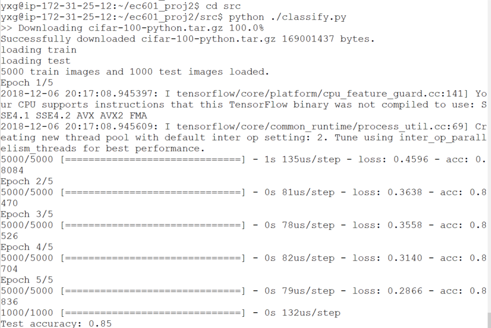

# Proj2: Image Classification
This is a easy implementation of image classification.

Data comes from CIFAR-100 and its coarse label `flower` and `vehicle1`. We have 5000 images for training and 1000 images for testing.

Implementation is a simple adaption of [keras-basic-classifiction](https://www.tensorflow.org/tutorials/keras/basic_classification), and finally I got the following result:  
  
with test accuracy 0.85.

## Usage
Clone this repo and simply run the following:
```
cd src
python ./classify.py
```
And the program will automatically download the dataset and do the training and evaluation job.

## Code
There are two files:
- cifar.py: download the dataset and load to python
- classify.py: get the specific class of image data and do the classification
